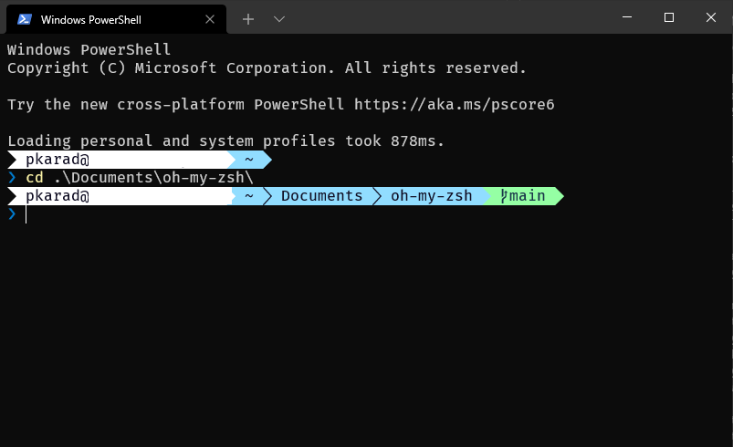

# oh-my-zsh
### This is how the Final Setup will look like : 😎

## Install oh-my-zsh on PowerShell
1. Install following modules
    ```
    Install-Module oh-my-posh
    Install-Module posh-git
    Install-Module PSReadLine -RequiredVersion 2.1.0
    ```
2. Save this file as Microsoft.PowerShell_profile.ps1 in $PROFILE path
    ```
    Import-Module oh-my-posh
    Import-Module posh-git
    Set-PoshPrompt -Theme Paradox

    # Shows navigable menu of all options when hitting Tab
    Set-PSReadLineKeyHandler -Key Tab -Function MenuComplete

    # Autocompleteion for Arrow keys
    Set-PSReadLineOption -HistorySearchCursorMovesToEnd
    Set-PSReadLineKeyHandler -Key UpArrow -Function HistorySearchBackward
    Set-PSReadLineKeyHandler -Key DownArrow -Function HistorySearchForward

    Set-PSReadLineOption -ShowToolTips
    Set-PSReadLineOption -PredictionSource History

    #Set the color for Prediction (auto-suggestion)
    # Set-PSReadLineOption -Colors @{InlinePrediction = "$([char]0x1b)[36;7;238m]"}
    Set-PSReadLineOption -Colors @{ InlinePrediction = '#000055'}
    ```
3. Install & Set FireCode font in Windows Terminal for PowerShell